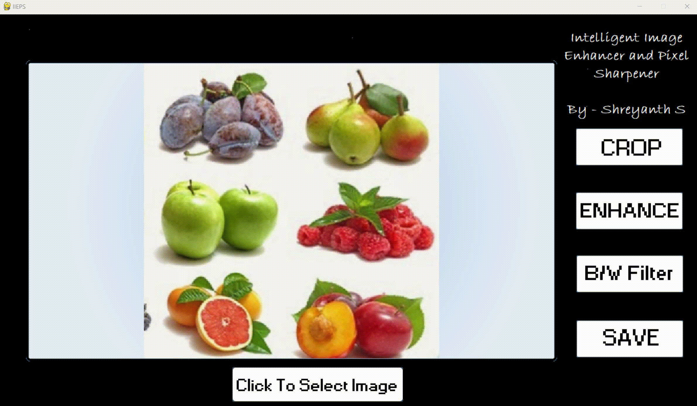
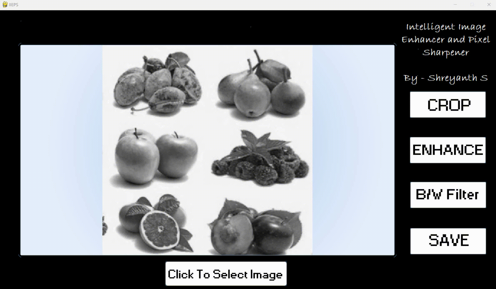
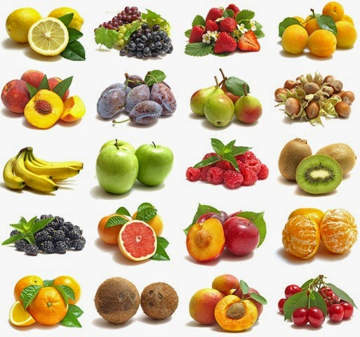
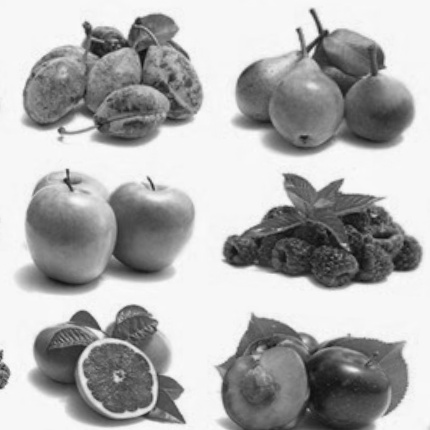
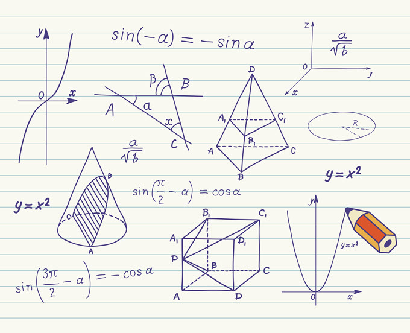
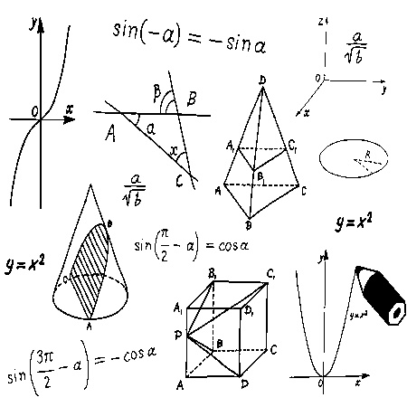
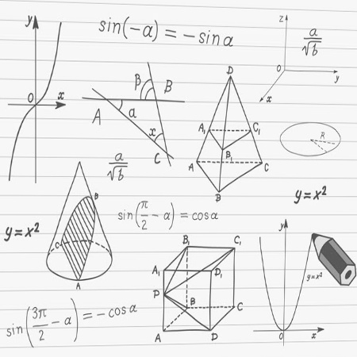

<div align="center">

# Intelligent Image Enhancer & Pixel Sharpener

**Desktop GUI tool for image enhancement, sharpening, grayscale conversion, and flexible custom cropping — with live before/after preview and local file export in under 100ms.**

[](https://python.org)
[](https://opencv.org)
[](https://docs.python.org/3/library/tkinter.html)
[](LICENSE)

</div>

---

## Features

| Operation | Description |
|-----------|-------------|
| **Enhance** | CLAHE · unsharp mask · kernel sharpening — 3 techniques to sharpen and restore detail |
| **Grayscale** | Convert to black & white with a single click |
| **Crop** | Flexible draggable boundaries — not locked to standard ratios; enter exact pixel dimensions |
| **Before / After Preview** | Live side-by-side comparison before saving |
| **Export** | Save processed image directly to your desktop |

---

## Results

| Metric | Value |
|--------|-------|
| Processing speed | **< 100ms** per image (desktop GUI) |
| Enhancement techniques | **3** — CLAHE · unsharp mask · kernel sharpening |
| Core operations | **4** — select · enhance/filter · crop · save |
| Live preview | Before / after comparison |

---

## Demo

### 1 — Select an image from your local desktop


### 2 — Crop with flexible boundaries and custom dimensions


### 3 — Apply enhancement or convert to black & white



### 4 — Save the final image to your desktop



---

## Sample Outputs

| Original | Enhanced | Black & White |
|----------|----------|---------------|
|  | — |  |
|  |  |  |

---

## Tech Stack

| Layer | Tool |
|-------|------|
| GUI | Tkinter |
| Image processing | OpenCV · PIL / Pillow |
| Numerical ops | NumPy |
| Rendering | Pygame · Matplotlib |
| Language | Python |

---

## Setup & Run

**Prerequisites:** Python 3.x

```bash
pip install numpy opencv-python pygame pillow matplotlib

# Run the application
python image_enhancer.py
The GUI will open — browse your local files, apply enhancements, crop, and save
